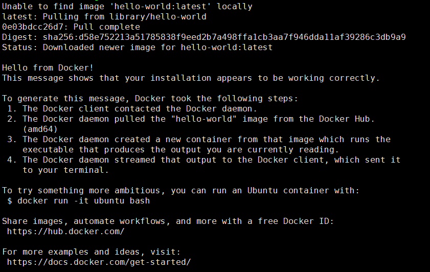

[notice] [官方安装教程](https://docs.docker.com/engine/install/ubuntu/) [/notice]

## 支持的Ubuntu版本

Ubuntu Focal 20.04 (LTS)

Ubuntu Eoan 19.10

Ubuntu Bionic 18.04 (LTS)

Ubuntu Xenial 16.04 (LTS)

## 卸载当前的旧版本

```
sudo apt-get remove docker docker-engine docker.io containerd runc
```

## 安装Docker

```
1. sudo apt-get update

2. sudo apt-get install \
    apt-transport-https \
    ca-certificates \
    curl \
    gnupg-agent \
    software-properties-common

3. curl -fsSL https://download.docker.com/linux/ubuntu/gpg | sudo apt-key add -

4. sudo add-apt-repository \
   "deb [arch=amd64] https://download.docker.com/linux/ubuntu \
   $(lsb_release -cs) \
   stable"

5. sudo apt-get update

6. sudo apt-get install docker-ce docker-ce-cli containerd.io
```

## 验证Docker安装是否成功

```
sudo docker run hello-world
```


