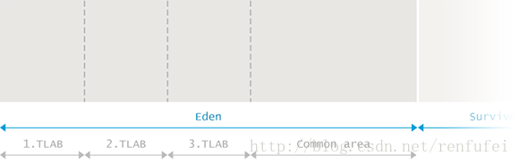
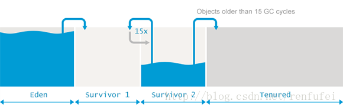

[notice]Java的JVM 知识整理。来源:https://blog.csdn.net/renfufei/column/info/14851[/notice]

说明:

在本文中, Garbage Collection 翻译为 “垃圾收集”, garbage collector 翻译为 “垃圾收集器”;

一般认为, 垃圾回收 和 垃圾收集 是同义词。

Minor GC 翻译为： 小型 GC; 而不是 次要 GC

Major GC 翻译为： 大型 GC; 而不是 主要 GC

原因在于,大部分情况下, 发生在年轻代的 Minor GC 次数会很多,翻译为次要GC明显不对。

Full GC 翻译为： 完全 GC; 为了清晰起见,一般直接译为 Full GC,读者明白即可; 其中大型 GC 和完全 GC 差不多, 这些术语出自官方的各种分析工具和垃圾收集日志。并不是很统一。

## 垃圾收集简介

顾名思义,垃圾收集(Garbage Collection)的意思就是 —— 找到垃圾并进行清理。但现有的垃圾收集实现却恰恰相反: 垃圾收集器跟踪所有正在使用的对象,并把其余部分当做垃圾。记住这一点以后, 我们再深入讲解内存自动回收的原理，探究 JVM 中垃圾收集的具体实现, 。

我们不抠细节, 先从基础开始, 介绍垃圾收集的一般特征、核心概念以及实现算法。

免责声明: 本文主要讲解 Oracle Hotspot 和 OpenJDK 的行为。对于其他 JVM, 如 jRockit 或者 IBM J9, 在某些方面可能会略有不同。

## 手动内存管理(Manual Memory Management)

当今的自动垃圾收集算法极为先进, 但我们先来看看什么是手动内存管理。在那个时候, 如果要存储共享数据, 必须显式地进行 内存分配(allocate)和内存释放(free)。如果忘记释放, 则对应的那块内存不能再次使用。内存一直被占着, 却不再使用，这种情况就称为内存泄漏(memory leak)。

以下是用C语言来手动管理内存的一个示例程序:

```
int send_request() {
    size_t n = read_size();
    int *elements = malloc(n * sizeof(int));

    if(read_elements(n, elements) < n) {
        // elements not freed!
        return -1;
    }

    // …

    free(elements)
    return 0;
}
```

可以看到,如果程序很长,或者结构比较复杂, 很可能就会忘记释放内存。内存泄漏曾经是个非常普遍的问题, 而且只能通过修复代码来解决。因此,业界迫切希望有一种更好的办法,来自动回收不再使用的内存,完全消除可能的人为错误。这种自动机制被称为 垃圾收集(Garbage Collection,简称 GC)。

### 智能指针(Smart Pointers)

第一代自动垃圾收集算法, 使用的是引用计数(reference counting)。针对每个对象, 只需要记住被引用的次数, 当引用计数变为0时, 这个对象就可以被安全地回收(reclaimed)了。一个著名的示例是 C++的共享指针(shared pointers):

```
int send_request() {
    size_t n = read_size();
    shared_ptr<vector<int>> elements 
              = make_shared<vector<int>>();

    if(read_elements(n, elements) < n) {
        return -1;
    }

    return 0;
}
```

shared_ptr 被用来跟踪引用的数量。作为参数传递时这个数字加1, 在离开作用域时这个数字减1。当引用计数变为0时, shared_ptr 自动删除底层的 vector。需要向读者指出的是，这种方式在实际编程中并不常见, 此处仅用于演示。

## 自动内存管理(Automated Memory Management)

上面的C++代码中,我们要显式地声明什么时候需要进行内存管理。但不能让所有的对象都具备这种特征呢? 那样就太方便了, 开发者不再耗费脑细胞, 去考虑要在何处进行内存清理。运行时环境会自动算出哪些内存不再使用，并将其释放。换句话说, 自动进行收集垃圾。第一款垃圾收集器是 1959 年为 Lisp 语言开发的, 此后 Lisp 的垃圾收集技术也一直处于业界领先水平。

### 引用计数(Reference Counting)

刚刚演示的C++共享指针方式, 可以应用到所有对象。许多语言都采用这种方法, 包括 Perl、Python 和 PHP 等。下图很好地展示了这种方式:


图中绿色的云(GC ROOTS) 表示程序正在使用的对象。从技术上讲, 这些可能是当前正在执行的方法中的局部变量，或者是静态变量一类。在某些编程语言中,可能叫法不太一样,这里不必抠名词。

蓝色的圆圈表示可以引用到的对象, 里面的数字就是引用计数。然后, 灰色的圆圈是各个作用域都不再引用的对象。灰色的对象被认为是垃圾, 随时会被垃圾收集器清理。

看起来很棒, 是吧! 但这种方式有个大坑, 很容易被循环引用(detached cycle) 给搞死。任何作用域中都没有引用指向这些对象，但由于循环引用, 导致引用计数一直大于零。如下图所示:


看到了吗? 红色的对象实际上属于垃圾。但由于引用计数的局限, 所以存在内存泄漏。

当然也有一些办法来应对这种情况, 例如 “弱引用”(‘weak’ references), 或者使用另外的算法来排查循环引用等。前面提到的 Perl、Python 和 PHP 等语言, 都使用了某些方式来解决循环引用问题, 但本文不对其进行讨论。下面介绍 JVM 中使用的垃圾收集方法。

### 标记-清除(Mark and Sweep)

首先, JVM 明确定义了什么是对象的可达性(reachability)。我们前面所说的绿色云这种只能算是模糊的定义, JVM 中有一类很明确很具体的对象, 称为 垃圾收集根元素(Garbage Collection Roots)，包括:

    (1)局部变量(Local variables)

    (2)活动线程(Active threads)

    (3)静态域(Static fields)

    (4)JNI引用(JNI references)

    (5)其他对象(稍后介绍 …)

    JVM 使用标记-清除算法(Mark and Sweep algorithm), 来跟踪所有的可达对象(即存活对象), 确保所有不可达对象(non-reachable objects)占用的内存都能被重用。其中包含两步:

    (6)Marking(标记): 遍历所有的可达对象,并在本地内存(native)中分门别类记下。
    
    (7)Sweeping(清除): 这一步保证了,不可达对象所占用的内存, 在之后进行内存分配时可以重用。

    JVM 中包含了多种GC算法, 如 Parallel Scavenge(并行清除), Parallel Mark+Copy(并行标记+复制) 以及 CMS, 他们在实现上略有不同, 但理论上都采用了以上两个步骤。

标记清除算法最重要的优势, 就是不再因为循环引用而导致内存泄露:


而不好的地方在于, 垃圾收集过程中, 需要暂停应用程序的所有线程。假如不暂停,则对象间的引用关系会一直不停地发生变化, 那样就没法进行统计了。这种情况叫做 STW 停顿(Stop The World pause, 全线暂停), 让应用程序暂时停止，让 JVM 进行内存清理工作。有很多原因会触发 STW 停顿, 其中垃圾收集是最主要的因素。

在本手册中,我们将介绍 JVM 中垃圾收集的实现原理，以及如何高效地利用 GC。

---

标记-清除(Mark and Sweep)是最经典的垃圾收集算法。将理论用于生产实践时, 会有很多需要优化调整的地点, 以适应具体环境。

下面通过一个简单的例子, 让我们一步步记录下来, 看看如何才能保证 JVM 能安全持续地分配对象。

## 碎片整理(Fragmenting and Compacting)

每次执行清除(sweeping), JVM 都必须保证不可达对象占用的内存能被回收重用。但这(最终)有可能会产生内存碎片(类似于磁盘碎片), 进而引发两个问题:

    写入操作越来越耗时, 因为寻找一块足够大的空闲内存会变得非常麻烦。

    在创建新对象时, JVM 在连续的块中分配内存。如果碎片问题很严重, 直至没有空闲片段能存放下新创建的对象,就会发生内存分配错误(allocation error)。

要避免这类问题,JVM 必须确保碎片问题不失控。因此在垃圾收集过程中, 不仅仅是标记和清除, 还需要执行 “内存碎片整理” 过程。这个过程让所有可达对象(reachable objects)依次排列, 以消除(或减少)碎片。示意图如下所示:


    说明:JVM中的引用是一个抽象的概念,如果GC移动某个对象, 就会修改(栈和堆中)所有指向该对象的引用。
    移动/提升/压缩 是一个 STW 的过程,所以修改对象引用是一个安全的行为。 

## 分代假设(Generational Hypothesis)

我们前面提到过,执行垃圾收集需要停止整个应用。很明显,对象越多则收集所有垃圾消耗的时间就越长。但可不可以只处理一个较小的内存区域呢? 为了探究这种可能性,研究人员发现,程序中的大多数可回收的内存可归为两类:

    (1)大部分对象很快就不再使用
    (2)还有一部分不会立即无用,但也不会持续(太)长时间

    这些观测形成了 弱代假设(Weak Generational Hypothesis)。基于这一假设, VM中的内存被分为年轻代(Young Generation)和老年代(Old Generation)。老年代有时候也称为 年老区(Tenured)。

    

拆分为这样两个可清理的单独区域，允许采用不同的算法来大幅提高GC的性能。

这种方法也不是没有问题。例如，在不同分代中的对象可能会互相引用, 在收集某一个分代时就会成为 “事实上的” GC root。

当然,要着重强调的是,分代假设并不适用于所有程序。因为GC算法专门针对“要么死得快”，“否则活得长” 这类特征的对象来进行优化, JVM 对收集那种存活时间半长不长的对象就显得非常尴尬了。

## 内存池(Memory Pools)

堆内存中的内存池划分也是类似的。不太容易理解的地方在于各个内存池中的垃圾收集是如何运行的。请注意,不同的GC算法在实现细节上可能会有所不同,但和本章所介绍的相关概念都是一致的。


## 新生代(Eden,伊甸园)

Eden 是内存中的一个区域, 用来分配新创建的对象。通常会有多个线程同时创建多个对象, 所以 Eden 区被划分为多个 线程本地分配缓冲区(Thread Local Allocation Buffer, 简称TLAB)。通过这种缓冲区划分,大部分对象直接由 JVM 在对应线程的TLAB中分配, 避免与其他线程的同步操作。

如果 TLAB 中没有足够的内存空间, 就会在共享 Eden 区(shared Eden space)之中分配。如果共享 Eden 区也没有足够的空间, 就会触发一次 年轻代 GC 来释放内存空间。如果 GC 之后 Eden 区依然没有足够的空闲内存区域, 则对象就会被分配到老年代空间(Old Generation)。

当 Eden 区进行垃圾收集时, GC 将所有从 root 可达的对象过一遍, 并标记为存活对象。

我们曾指出,对象间可能会有跨代的引用, 所以需要一种方法来标记从其他分代中指向 Eden 的所有引用。这样做又会遭遇各个分代之间一遍又一遍的引用。JVM 在实现时采用了一些绝招: 卡片标记(card-marking)。从本质上讲,JVM 只需要记住 Eden 区中 “脏”对象的粗略位置, 可能有老年代的对象引用指向这部分区间。更多细节请参考: Nitsan 的博客 。



标记阶段完成后, Eden中所有存活的对象都会被复制到存活区(Survivor spaces)里面。整个Eden区就可以被认为是空的, 然后就能用来分配新对象。这种方法称为 “标记-复制”(Mark and Copy): 存活的对象被标记, 然后复制到一个存活区(注意,是复制,而不是移动)。

## 存活区(Survivor Spaces)

Eden 区的旁边是两个存活区, 称为 from 空间和 to 空间。需要着重强调的的是, 任意时刻总有一个存活区是空的(empty)。

空的那个存活区用于在下一次年轻代 GC 时存放收集的对象。年轻代中所有的存活对象(包括 Edenq 区和非空的那个 “from” 存活区)都会被复制到 ”to“ 存活区。GC 过程完成后, ”to“ 区有对象,而 ‘from’ 区里没有对象。两者的角色进行正好切换 。



存活的对象会在两个存活区之间复制多次, 直到某些对象的存活 时间达到一定的阀值。分代理论假设, 存活超过一定时间的对象很可能会继续存活更长时间。

这类“ 年老” 的对象因此被提升(promoted )到老年代。提升的时候， 存活区的对象不再是复制到另一个存活区,而是迁移到老年代, 并在老年代一直驻留, 直到变为不可达对象。

为了确定一个对象是否“足够老”, 可以被提升(Promotion)到老年代，GC模块跟踪记录每个存活区对象存活的次数。每次分代GC完成后,存活对象的年龄就会增长。当年龄超过提升阈值(tenuring threshold), 就会被提升到老年代区域。

具体的提升阈值由JVM动态调整,但也可以用参数-XX:+MaxTenuringThreshold 来指定上限。如果设置 -XX:+MaxTenuringThreshold=0, 则GC时存活对象不在存活区之间复制，直接提升到老年代。现代 JVM 中这个阈值默认设置为15个 GC 周期。这也是HotSpot中的最大值。

如果存活区空间不够存放年轻代中的存活对象，提升(Promotion)也可能更早地进行。

## 老年代(Old Generation)

老年代的GC实现要复杂得多。老年代内存空间通常会更大，里面的对象是垃圾的概率也更小。

老年代GC发生的频率比年轻代小很多。同时, 因为预期老年代中的对象大部分是存活的, 所以不再使用标记和复制(Mark and Copy)算法。而是采用移动对象的方式来实现最小化内存碎片。老年代空间的清理算法通常是建立在不同的基础上的。原则上,会执行以下这些步骤:

    (1)通过标志位(marked bit),标记所有通过 GC roots 可达的对象.
    
    (2)删除所有不可达对象
    
    (3)整理老年代空间中的内容，方法是将所有的存活对象复制,从老年代空间开始的地方,依次存放。
    
通过上面的描述可知, 老年代GC必须明确地进行整理,以避免内存碎片过多。

## 永久代(PermGen)

在Java 8 之前有一个特殊的空间,称为“永久代”(Permanent Generation)。这是存储元数据(metadata)的地方,比如 class 信息等。

此外,这个区域中也保存有其他的数据和信息, 包括 内部化的字符串(internalized strings)等等。实际上这给Java开发者造成了很多麻烦,因为很难去计算这块区域到底需要占用多少内存空间。

预测失败导致的结果就是产生 java.lang.OutOfMemoryError: Permgen space 这种形式的错误。除非 ·OutOfMemoryError· 确实是内存泄漏导致的,否则就只能增加 permgen 的大小，例如下面的示例，就是设置 permgen 最大空间为 256 MB:

```
java -XX:MaxPermSize=256m com.mycompany.MyApplication
```

## 元数据区(Metaspace)

既然估算元数据所需空间那么复杂, Java 8直接删除了永久代(Permanent Generation)，改用 Metaspace。从此以后, Java 中很多杂七杂八的东西都放置到普通的堆内存里。

当然，像类定义(class definitions)之类的信息会被加载到 Metaspace 中。元数据区位于本地内存(native memory),不再影响到普通的 Java 对象。默认情况下, Metaspace 的大小只受限于 Java进程可用的本地内存。这样程序就不再因为多加载了几个类/JAR包就导致 java.lang.OutOfMemoryError: Permgen space. 。注意, 这种不受限制的空间也不是没有代价的 —— 如果 Metaspace 失控, 则可能会导致很严重的内存交换(swapping), 或者导致本地内存分配失败。

如果需要避免这种最坏情况，那么可以通过下面这样的方式来限制 Metaspace 的大小, 如 256 MB:

```
java -XX:MaxMetaspaceSize=256m com.mycompany.MyApplication
```

## Minor GC vs Major GC vs Full GC

垃圾收集事件(Garbage Collection events)通常分为: 小型GC(Minor GC) – 大型GC(Major GC) – 和完全GC(Full GC) 。本节介绍这些事件及其区别。然后你会发现这些区别也不是特别清晰。

最重要的是,应用程序是否满足 服务级别协议(Service Level Agreement, SLA), 并通过监控程序查看响应延迟和吞吐量。也只有那时候才能看到GC事件相关的结果。重要的是这些事件是否停止整个程序,以及持续多长时间。

虽然 Minor, Major 和 Full GC 这些术语被广泛应用, 但并没有标准的定义, 我们还是来深入了解一下具体的细节吧。

## 小型GC(Minor GC)

年轻代内存的垃圾收集事件称为小型 GC。这个定义既清晰又得到广泛共识。对于小型 GC 事件,有一些有趣的事情你应该了解一下:

1、当JVM无法为新对象分配内存空间时总会触发 Minor GC,比如 Eden 区占满时。所以(新对象)分配频率越高, Minor GC 的频率就越高。
2、Minor GC 事件实际上忽略了老年代。从老年代指向年轻代的引用都被认为是 GC Root。而从年轻代指向老年代的引用在标记阶段全部被忽略。
3、与一般的认识相反, Minor GC 每次都会引起全线停顿(stop-the-world ), 暂停所有的应用线程。对大多数程序而言,暂停时长基本上是可以忽略不计的, 因为 Eden 区的对象基本上都是垃圾, 也不怎么复制到存活区/老年代。如果情况不是这样, 大部分新创建的对象不能被垃圾回收清理掉, 则 Minor GC 的停顿就会持续更长的时间。

所以 Minor GC 的定义很简单 —— Minor GC 清理的就是年轻代。

## Major GC vs Full GC

值得一提的是, 这些术语并没有正式的定义 —— 无论是在JVM规范还是在GC相关论文中。

我们知道, Minor GC 清理的是年轻代空间(Young space)，相应的,其他定义也很简单:

    Major GC(大型GC) 清理的是老年代空间(Old space)。
    Full GC(完全GC)清理的是整个堆, 包括年轻代和老年代空间。

杯具的是更复杂的情况出现了。很多 Major GC 是由 Minor GC 触发的, 所以很多情况下这两者是不可分离的。另一方面, 像G1这样的垃圾收集算法执行的是部分区域垃圾回收, 所以，额，使用术语“cleaning”并不是非常准确。

这也让我们认识到,不应该去操心是叫 Major GC 呢还是叫 Full GC, 我们应该关注的是: 某次GC事件 是否停止所有线程,或者是与其他线程并发执行。

这些混淆甚至根植于标准的JVM工具中。我的意思可以通过实例来说明。让我们来对比同一JVM中两款工具的GC信息输出吧。这个JVM使用的是 并发标记和清除收集器（Concurrent Mark and Sweep collector，-XX:+UseConcMarkSweepGC).

首先我们来看 jstat 的输出:

```
jstat -gc -t 4235 1s
```

```
Time   S0C    S1C     S0U    S1U      EC       EU        OC         OU       MC       MU     CCSC   CCSU     YGC    YGCT    FGC    FGCT     GCT   
 5.7 34048.0 34048.0  0.0   34048.0 272640.0 194699.7 1756416.0   181419.9  18304.0 17865.1 2688.0 2497.6      3    0.275   0      0.000    0.275
 6.7 34048.0 34048.0 34048.0  0.0   272640.0 247555.4 1756416.0   263447.9  18816.0 18123.3 2688.0 2523.1      4    0.359   0      0.000    0.359
 7.7 34048.0 34048.0  0.0   34048.0 272640.0 257729.3 1756416.0   345109.8  19072.0 18396.6 2688.0 2550.3      5    0.451   0      0.000    0.451
 8.7 34048.0 34048.0 34048.0 34048.0 272640.0 272640.0 1756416.0  444982.5  19456.0 18681.3 2816.0 2575.8      7    0.550   0      0.000    0.550
 9.7 34048.0 34048.0 34046.7  0.0   272640.0 16777.0  1756416.0   587906.3  20096.0 19235.1 2944.0 2631.8      8    0.720   0      0.000    0.720
10.7 34048.0 34048.0  0.0   34046.2 272640.0 80171.6  1756416.0   664913.4  20352.0 19495.9 2944.0 2657.4      9    0.810   0      0.000    0.810
11.7 34048.0 34048.0 34048.0  0.0   272640.0 129480.8 1756416.0   745100.2  20608.0 19704.5 2944.0 2678.4     10    0.896   0      0.000    0.896
12.7 34048.0 34048.0  0.0   34046.6 272640.0 164070.7 1756416.0   822073.7  20992.0 19937.1 3072.0 2702.8     11    0.978   0      0.000    0.978
13.7 34048.0 34048.0 34048.0  0.0   272640.0 211949.9 1756416.0   897364.4  21248.0 20179.6 3072.0 2728.1     12    1.087   1      0.004    1.091
14.7 34048.0 34048.0  0.0   34047.1 272640.0 245801.5 1756416.0   597362.6  21504.0 20390.6 3072.0 2750.3     13    1.183   2      0.050    1.233
15.7 34048.0 34048.0  0.0   34048.0 272640.0 21474.1  1756416.0   757347.0  22012.0 20792.0 3200.0 2791.0     15    1.336   2      0.050    1.386
16.7 34048.0 34048.0 34047.0  0.0   272640.0 48378.0  1756416.0   838594.4  22268.0 21003.5 3200.0 2813.2     16    1.433   2      0.050    1.484
```

此片段截取自JVM启动后的前17秒。根据这些信息可以得知: 有2次Full ``GC在12次Minor GC(YGC)之后触发执行, 总计耗时 50ms。当然,也可以通过具备图形界面的工具得出同样的信息, 比如 jconsole 或者 jvisualvm (或者最新的 jmc)。

在下结论之前, 让我们看看此JVM进程的GC日志。显然需要配置 -XX:+PrintGCDetails 参数,GC日志的内容更详细,结果也有一些不同:

```
java -XX:+PrintGCDetails -XX:+UseConcMarkSweepGC eu.plumbr.demo.GarbageProducer
```

```
3.157: [GC (Allocation Failure) 3.157: [ParNew: 272640K->34048K(306688K), 0.0844702 secs] 272640K->69574K(2063104K), 0.0845560 secs] [Times: user=0.23 sys=0.03, real=0.09 secs] 
4.092: [GC (Allocation Failure) 4.092: [ParNew: 306688K->34048K(306688K), 0.1013723 secs] 342214K->136584K(2063104K), 0.1014307 secs] [Times: user=0.25 sys=0.05, real=0.10 secs] 
... cut for brevity ...

11.292: [GC (Allocation Failure) 11.292: [ParNew: 306686K->34048K(306688K), 0.0857219 secs] 971599K->779148K(2063104K), 0.0857875 secs] [Times: user=0.26 sys=0.04, real=0.09 secs] 
12.140: [GC (Allocation Failure) 12.140: [ParNew: 306688K->34046K(306688K), 0.0821774 secs] 1051788K->856120K(2063104K), 0.0822400 secs] [Times: user=0.25 sys=0.03, real=0.08 secs] 
12.989: [GC (Allocation Failure) 12.989: [ParNew: 306686K->34048K(306688K), 0.1086667 secs] 1128760K->931412K(2063104K), 0.1087416 secs] [Times: user=0.24 sys=0.04, real=0.11 secs] 
13.098: [GC (CMS Initial Mark) [1 CMS-initial-mark: 897364K(1756416K)] 936667K(2063104K), 0.0041705 secs] [Times: user=0.02 sys=0.00, real=0.00 secs] 
13.102: [CMS-concurrent-mark-start]
13.341: [CMS-concurrent-mark: 0.238/0.238 secs] [Times: user=0.36 sys=0.01, real=0.24 secs] 
13.341: [CMS-concurrent-preclean-start]
13.350: [CMS-concurrent-preclean: 0.009/0.009 secs] [Times: user=0.03 sys=0.00, real=0.01 secs] 
13.350: [CMS-concurrent-abortable-preclean-start]
13.878: [GC (Allocation Failure) 13.878: [ParNew: 306688K->34047K(306688K), 0.0960456 secs] 1204052K->1010638K(2063104K), 0.0961542 secs] [Times: user=0.29 sys=0.04, real=0.09 secs] 
14.366: [CMS-concurrent-abortable-preclean: 0.917/1.016 secs] [Times: user=2.22 sys=0.07, real=1.01 secs] 
14.366: [GC (CMS Final Remark) [YG occupancy: 182593 K (306688 K)]14.366: [Rescan (parallel) , 0.0291598 secs]14.395: [weak refs processing, 0.0000232 secs]14.395: [class unloading, 0.0117661 secs]14.407: [scrub symbol table, 0.0015323 secs]14.409: [scrub string table, 0.0003221 secs][1 CMS-remark: 976591K(1756416K)] 1159184K(2063104K), 0.0462010 secs] [Times: user=0.14 sys=0.00, real=0.05 secs] 
14.412: [CMS-concurrent-sweep-start]
14.633: [CMS-concurrent-sweep: 0.221/0.221 secs] [Times: user=0.37 sys=0.00, real=0.22 secs] 
14.633: [CMS-concurrent-reset-start]
14.636: [CMS-concurrent-reset: 0.002/0.002 secs] [Times: user=0.00 sys=0.00, real=0.00 secs]
```

通过 GC 日志可以看到, 在 12 次 Minor GC 之后发生了一些 “不同的事情”。并不是两个 Full GC, 而是在老年代执行了一次 GC, 分为多个阶段执行:

    (1)初始标记阶段(Initial Mark phase),耗时 0.0041705 秒(约 4ms)。此阶段是全线停顿(STW)事件,暂停所有应用线程,以便执行初始标记。
    
    (2)标记和预清理阶段(Markup and Preclean phase)。和应用线程并发执行。
    
    (3)最终标记阶段(Final Remark phase), 耗时 0.0462010 秒(约 46ms)。此阶段也是全线停顿(STW)事件。
    
    (4)清除操作(Sweep)是并发执行的, 不需要暂停应用线程。

所以从实际的 GC 日志可以看到, 并不是执行了两次 Full GC 操作, 而是只执行了一次清理老年代空间的 Major GC 。

如果只关心延迟, 通过后面 jstat 显示的数据, 也能得出正确的结果。它正确地列出了两次 STW 事件,总计耗时 50 ms。这段时间影响了所有应用线程的延迟。如果想要优化吞吐量, 这个结果就会有误导性 —— jstat 只列出了 stop-the-world 的初始标记阶段和最终标记阶段, jstat 的输出完全隐藏了并发执行的GC阶段。